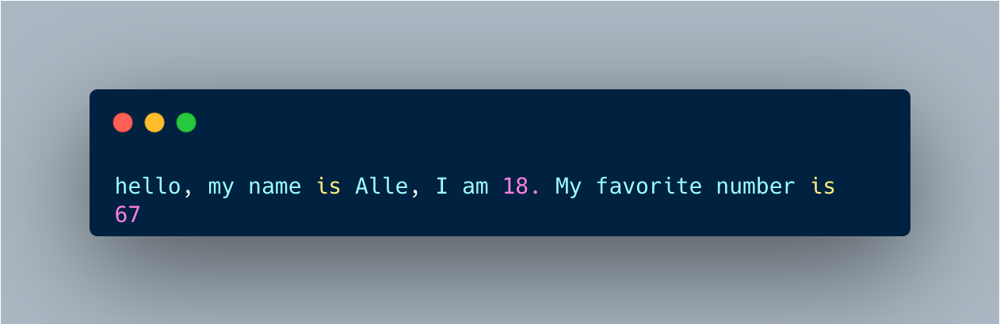

# 附录A：Markdown 完全指南

### 写出漂亮的技术文档

> 📖 **本章定位：附录参考手册** 🎯 **目标：掌握 GitBook 支持的所有 Markdown 语法，并学会在文档中优雅地展示 Python 代码** 💡 **使用方法：边看边练，随时查阅**

***

### 目录

1. 什么是 Markdown
2. 标题与层级结构
3. 段落与文字样式
4. 列表
5. 代码展示（重点）
6. 表格
7. 引用块与提示框
8. 链接与图片
9. 水平线与分隔
10. GitBook 专有功能
11. Python 代码展示最佳实践
12. 完整文档模板

***

### 什么是 Markdown

Markdown 是一种**轻量级标记语言**，用普通文本符号来表达格式，写起来像纯文本，渲染后变成美观的 HTML。

#### 为什么用 Markdown 写技术文档？

* ✅ 纯文本，任何编辑器都能打开
* ✅ 语法简单，几分钟上手
* ✅ 代码块支持语法高亮
* ✅ GitBook、GitHub、Notion 等平台原生支持
* ✅ 专注内容，不被格式分心

#### Markdown 的工作原理

```
你写的 Markdown 源码          渲染后的效果
─────────────────────        ─────────────────────
# 一级标题                →   大号加粗标题
**粗体文字**              →   粗体文字
- 列表项                  →   • 列表项
` ` `python               →   带语法高亮的代码块
print("hello")
` ` `
```

***

### 标题与层级结构

使用 `#` 号表示标题，`#` 越多级别越低：

**源码：**

```markdown
# 一级标题（H1）— 通常是页面/章节主标题
## 二级标题（H2）— 主要节
### 三级标题（H3）— 小节
#### 四级标题（H4）— 子小节
##### 五级标题（H5）— 较少使用
###### 六级标题（H6）— 极少使用
```

**效果预览：**

## 一级标题

### 二级标题

#### 三级标题

**四级标题**

> 💡 **GitBook 建议：** 每个文件只用一个 H1（页面标题），正文层级从 H2 开始，最深到 H4。层级太深会让读者迷失。

***

### 段落与文字样式

#### 段落

直接写文字就是段落。段落之间用**空行**分隔（不是换行，是空一行）：

```markdown
这是第一段。这段有多句话，
这里虽然换行了，但渲染后仍是同一段落。

空一行之后，这才是第二段。
```

如果需要强制换行但不另起段落，在行末加**两个空格**后换行：

```markdown
第一行（行末有两个空格）  
第二行（与上面在同一段落但换了行）
```

***

#### 文字样式

| 效果   | 源码                  | 渲染结果      |
| ---- | ------------------- | --------- |
| 粗体   | `**粗体**` 或 `__粗体__` | **粗体**    |
| 斜体   | `*斜体*` 或 `_斜体_`     | _斜体_      |
| 粗斜体  | `***粗斜体***`         | _**粗斜体**_ |
| 删除线  | `~~删除~~`            | ~~删除~~    |
| 行内代码 | `` `代码` ``          | `代码`      |
| 下标   | `H~2~O`（部分平台）       | H₂O       |
| 上标   | `x^2^`（部分平台）        | x²        |

**示例：**

```markdown
Python 是**世界上最流行**的编程语言之一。
学习 Python，你需要先安装 `python3`。
不推荐使用 ~~Python 2~~，它已经停止维护。
```

渲染效果：

Python 是**世界上最流行**的编程语言之一。 学习 Python，你需要先安装 `python3`。 不推荐使用 ~~Python 2~~，它已经停止维护。

***

### 列表

#### 无序列表

使用 `-`、`*` 或 `+` 开头（推荐统一用 `-`）：

```markdown
- 苹果
- 香蕉
- 橙子
  - 脐橙（缩进 2 空格 = 子列表）
  - 血橙
    - 西西里血橙（再深一层）
```

渲染效果：

* 苹果
* 香蕉
* 橙子
  * 脐橙
  * 血橙
    * 西西里血橙

***

#### 有序列表

```markdown
1. 第一步：安装 Python
2. 第二步：打开终端
3. 第三步：输入 `python3 --version`
   1. 如果显示版本号，安装成功
   2. 如果报错，检查环境变量
4. 第四步：开始学习！
```

渲染效果：

1. 第一步：安装 Python
2. 第二步：打开终端
3. 第三步：输入 `python3 --version`
   1. 如果显示版本号，安装成功
   2. 如果报错，检查环境变量
4. 第四步：开始学习！

> 💡 **技巧：** 有序列表的数字不必连续，Markdown 会自动排序。全部写 `1.` 也没问题：
>
> ```markdown
> 1. 第一项
> 1. 第二项（写 1. 也会渲染为 2.）
> 1. 第三项
> ```

***

#### 任务列表（Checklist）

GitBook 和 GitHub 支持任务列表：

```markdown
- [x] 安装 Python 3.x
- [x] 完成第 01 课：变量与数据类型
- [x] 完成第 02 课：条件判断与循环
- [x] 完成第 03 课：字符串操作
- [ ] 完成第 04 课：列表、字典、集合
- [ ] 完成第 05 课：函数
- [ ] 完成第 10 课：综合项目
```

渲染效果：

* [x] 安装 Python 3.x
* [x] 完成第 01 课：变量与数据类型
* [ ] 完成第 04 课：列表、字典、集合
* [ ] 完成第 05 课：函数

***

### 代码展示（重点）

这是技术文档最核心的部分。Markdown 提供两种代码展示方式。

***

#### 行内代码

用单个反引号包裹，适合在句子中提及变量名、函数名、命令等：

```markdown
使用 `print()` 函数输出内容。
变量 `name` 存储了用户的姓名。
在终端运行 `python3 hello.py` 来执行脚本。
```

渲染效果：

使用 `print()` 函数输出内容。 变量 `name` 存储了用户的姓名。 在终端运行 `python3 hello.py` 来执行脚本。

***

#### 代码块

用三个反引号（` ``` `）包裹，并在开头指定语言名称以启用**语法高亮**：

````markdown
```python
def greet(name):
    print(f"你好，{name}！")

greet("小明")
```
````

渲染效果：

```python
def greet(name):
    print(f"你好，{name}！")

greet("小明")
```

***

#### 支持的语言标识符

GitBook 代码块支持数百种语言，以下是常用的：

| 语言标识符                | 对应语言        | 示例                |
| -------------------- | ----------- | ----------------- |
| `python`             | Python      | ` ```python `     |
| `bash` / `shell`     | 终端命令        | ` ```bash `       |
| `javascript` / `js`  | JavaScript  | ` ```javascript ` |
| `html`               | HTML        | ` ```html `       |
| `css`                | CSS         | ` ```css `        |
| `json`               | JSON 数据     | ` ```json `       |
| `sql`                | SQL 查询      | ` ```sql `        |
| `markdown` / `md`    | Markdown 本身 | ` ```markdown `   |
| `text` / `plaintext` | 纯文本（无高亮）    | ` ```text `       |
| `diff`               | 差异对比        | ` ```diff `       |

***

#### 展示终端输出

对于命令行交互，使用 `bash` 或 `text` 标识符，用 `$` 表示命令提示符：

````markdown
```bash
$ python3 --version
Python 3.12.0

$ python3 hello.py
Hello, World!
```
````

渲染效果：

```bash
$ python3 --version
Python 3.12.0

$ python3 hello.py
Hello, World!
```

***

#### diff 差异高亮

展示代码修改前后的对比，`-` 表示删除（红色），`+` 表示新增（绿色）：

````markdown
```diff
def greet(name):
-   print("你好" + name)
+   print(f"你好，{name}！")
```
````

渲染效果：

```diff
def greet(name):
-   print("你好" + name)
+   print(f"你好，{name}！")
```

***

### 表格

#### 基本语法

```markdown
| 列标题 1 | 列标题 2 | 列标题 3 |
|----------|----------|----------|
| 单元格   | 单元格   | 单元格   |
| 内容 A   | 内容 B   | 内容 C   |
```

渲染效果：

| 列标题 1 | 列标题 2 | 列标题 3 |
| ----- | ----- | ----- |
| 单元格   | 单元格   | 单元格   |
| 内容 A  | 内容 B  | 内容 C  |

***

#### 对齐控制

在分隔行（`---`）中用 `:` 控制对齐方式：

```markdown
| 左对齐   | 居中对齐 | 右对齐   |
|:---------|:--------:|---------:|
| Python   |   3.12   |  ★★★★★  |
| 左边内容 | 中间内容 | 右边内容 |
```

渲染效果：

| 左对齐    | 居中对齐 |   右对齐 |
| ------ | :--: | ----: |
| Python | 3.12 | ★★★★★ |
| 左边内容   | 中间内容 |  右边内容 |

***

#### 表格中使用代码

```markdown
| 方法 | 语法 | 示例 |
|------|------|------|
| 大写 | `str.upper()` | `"hello".upper()` → `"HELLO"` |
| 分割 | `str.split(sep)` | `"a,b".split(",")` → `['a','b']` |
| 长度 | `len(str)` | `len("hello")` → `5` |
```

渲染效果：

| 方法 | 语法               | 示例                               |
| -- | ---------------- | -------------------------------- |
| 大写 | `str.upper()`    | `"hello".upper()` → `"HELLO"`    |
| 分割 | `str.split(sep)` | `"a,b".split(",")` → `['a','b']` |
| 长度 | `len(str)`       | `len("hello")` → `5`             |

***

### 引用块与提示框

#### 基本引用块

使用 `>` 开头创建引用块，可以嵌套：

```markdown
> 这是一段引用。
> 可以多行。
>
> 甚至可以有段落间隔。
>
> > 这是嵌套引用（缩进一级）。
> > > 还可以再嵌套。
```

渲染效果：

> 这是一段引用。 可以多行。
>
> 甚至可以有段落间隔。
>
> > 这是嵌套引用（缩进一级）。

***

#### 提示框（GitBook 专有）

GitBook 支持用 `>` 加 emoji 创建语义化提示框，视觉上有颜色区分：

```markdown
> 💡 **提示（Tip）：** 这里是小技巧或建议，蓝色风格。

> ⚠️ **注意（Warning）：** 这里是需要留意的事项，黄色风格。

> ❌ **错误（Danger）：** 这里是危险操作提示，红色风格。

> ✅ **成功（Success）：** 这里是正确做法或成功提示，绿色风格。

> 📌 **重要（Info）：** 这里是重要信息，用于强调关键内容。
```

渲染效果：

> 💡 **提示（Tip）：** 这里是小技巧或建议，蓝色风格。

> ⚠️ **注意（Warning）：** 这里是需要留意的事项，黄色风格。

> ❌ **错误（Danger）：** 这里是危险操作提示，红色风格。

> ✅ **成功（Success）：** 这里是正确做法或成功提示，绿色风格。

> 📌 **重要（Info）：** 这里是重要信息，用于强调关键内容。

***

#### 引用块内嵌代码

引用块内部可以使用完整的 Markdown 语法，包括代码块：

````markdown
> ⚠️ **常见错误：** 忘记转换类型会导致报错。
>
> 错误示范：
> ```python
> age = input("输入年龄：")
> print(age + 1)   # ❌ TypeError！input 返回字符串
> ```
>
> 正确写法：
> ```python
> age = int(input("输入年龄："))
> print(age + 1)   # ✅ 先转为整数
> ```
````

渲染效果：

> ⚠️ **常见错误：** 忘记转换类型会导致报错。
>
> 错误示范：
>
> ```python
> age = input("输入年龄：")
> print(age + 1)   # ❌ TypeError！input 返回字符串
> ```
>
> 正确写法：
>
> ```python
> age = int(input("输入年龄："))
> print(age + 1)   # ✅ 先转为整数
> ```

***

### 链接与图片

#### 链接

```markdown
<!-- 行内链接 -->
[Python 官网](https://www.python.org)

<!-- 带 title 的链接（鼠标悬停显示提示） -->
[Python 官网](https://www.python.org "点击访问 Python 官网")

<!-- 引用式链接（适合同一链接多次使用） -->
访问 [Python 官网][python] 或查看 [官方文档][python-docs]。

[python]: https://www.python.org
[python-docs]: https://docs.python.org/3/

<!-- 自动链接 -->
<https://www.python.org>

<!-- 页内锚点链接（跳转到同页标题） -->
[回到顶部](#python-基础从零起飞)
```

渲染效果：

[Python 官网](https://www.python.org)

***

#### 图片

图片语法与链接相似，在前面加 `!`：

```markdown
<!-- 行内图片 -->


<!-- 带 alt 和 title -->


<!-- 引用式图片 -->
![Python Logo][logo]

[logo]: https://www.python.org/static/img/python-logo.png
```

> 💡 **技巧：** GitBook 支持直接拖拽图片上传，自动生成 Markdown 语法。

***

#### 图片链接（可点击的图片）

将图片嵌套在链接语法中：

```markdown
[](https://www.python.org)
```

***

### 水平线与分隔

三种写法均可，推荐统一使用 `---`：

```markdown
---

***

___
```

> 💡 水平线上方必须有空行，否则会被解析为标题的下划线格式。

***

### GitBook 专有功能

除了标准 Markdown，GitBook 还提供以下增强功能：

***

#### Hint 提示块（原生组件）

GitBook 原生支持四种 Hint 块（在编辑器中通过 `/hint` 插入）：

```markdown

**信息提示** 这里是说明性内容，蓝色背景。



**成功提示** 操作成功的反馈，绿色背景。



**警告提示** 需要注意的事项，黄色背景。



**危险提示** 危险操作或重要警告，红色背景。

```

***

#### 代码块带标题（GitBook 增强）

GitBook 支持在代码块上方显示文件名或标题：

````markdown

<div data-gb-custom-block data-tag="code" data-title='hello.py'>

```python
# 这是文件 hello.py 的内容
name = input("你的名字：")
print(f"你好，{name}！")
```

</div>

````

***

#### 代码块高亮行（GitBook 增强）

````markdown

<div data-gb-custom-block data-tag="code" data-lineNumbers='true' data-gitbook-props='{"highlightLines":"3,4"}'>

```python
name = "小明"
age = 18
score = 95   # ← 这行会被高亮
print(score) # ← 这行也会被高亮
```

</div>

````

***

#### 行号显示

````markdown

<div data-gb-custom-block data-tag="code" data-lineNumbers='true'>

```python
def fibonacci(n):
    if n <= 1:
        return n
    return fibonacci(n-1) + fibonacci(n-2)

print(fibonacci(10))   # 输出：55
```

</div>

````

***

#### Tabs 标签页

适合展示同一内容的多种语言或方式：

````markdown


```python
print("Hello, World!")
````

\{% endtab %\}

\{% tab title="JavaScript" %\}

```javascript
console.log("Hello, World!");
```

\{% endtab %\}

\{% tab title="终端输出" %\}

```
Hello, World!
```

\{% endtab %\} \{% endtabs %\}

````

---

### 折叠块（Expandable）

```markdown
<details>
<summary>点击展开：什么是 f-string？</summary>

f-string 是 Python 3.6 引入的字符串格式化语法。在引号前加 `f`，即可在 `{}` 中直接嵌入变量或表达式：

```python
name = "小明"
age = 18
print(f"我叫{name}，今年{age}岁")
# 输出：我叫小明，今年18岁
````

\`\`\`

***

#### 数学公式（KaTeX）

GitBook 支持 LaTeX 数学公式（需开启 Math 扩展）：

```markdown
<!-- 行内公式 -->
圆面积公式：$S = \pi r^2$

<!-- 独立块公式 -->
$$
S = \pi r^2 = 3.14159 \times r^2
$$

<!-- 复杂公式 -->
$$
f(x) = \sum_{i=0}^{n} \frac{a_i}{1+x}
$$
```

***

#### 内嵌 API 文档块

GitBook 支持 OpenAPI / Swagger 嵌入：

```markdown


```

***

### Python 代码展示最佳实践

这是写 Python 教程时最重要的规范，决定了文档的专业程度。

***

#### 规范 1：总是指定语言

````markdown
<!-- ❌ 不指定语言，无高亮，难以阅读 -->
```
x = 10
print(x)
```

<!-- ✅ 指定 python，有语法高亮 -->
```python
x = 10
print(x)
```
````

***

#### 规范 2：分离代码与输出

将代码和运行结果明确分开，使用注释或单独的输出块：

````markdown
<!-- 方式一：注释标注（简洁，适合短输出） -->
```python
print(1 + 2)   # 输出：3
name = "小明"
print(f"你好，{name}！")   # 输出：你好，小明！
```

<!-- 方式二：独立输出块（清晰，适合多行输出） -->
```python
for i in range(1, 4):
    print(f"第 {i} 次循环")
```

**输出：**
```text
第 1 次循环
第 2 次循环
第 3 次循环
```
````

渲染效果：

```python
for i in range(1, 4):
    print(f"第 {i} 次循环")
```

**输出：**

```
第 1 次循环
第 2 次循环
第 3 次循环
```

***

#### 规范 3：错误示范 vs 正确示范

用 `diff` 块或并排展示对比，让读者一眼看出区别：

````markdown
```diff
# 比较两种字符串格式化方式
- result = "我叫" + name + "，今年" + str(age) + "岁"  # 繁琐
+ result = f"我叫{name}，今年{age}岁"                   # 简洁
```
````

或者用注释 `# ❌` 和 `# ✅` 标注：

```python
# ❌ 错误：直接拼接，类型不一致会报错
age = 18
print("今年" + age + "岁")     # TypeError!

# ✅ 正确：转换类型后拼接，或使用 f-string
print("今年" + str(age) + "岁")   # 方法一
print(f"今年{age}岁")             # 方法二（推荐）
```

***

#### 规范 4：添加有意义的注释

注释应该解释"为什么"，而不仅仅是"做了什么"：

````markdown
```python
# ❌ 无效注释：只是重复代码
x = x + 1    # x 加 1

# ✅ 有效注释：解释目的
x = x + 1    # 移动到下一个位置

# ✅ 解释复杂逻辑
# 使用 [::-1] 切片反转字符串，比 reversed() + join() 更简洁
result = text[::-1]
```
````

***

#### 规范 5：交互式示例格式

展示 Python 交互式解释器（REPL）时，使用 `>>>` 提示符：

````markdown
```python
>>> name = "Python"
>>> len(name)
6
>>> name.upper()
'PYTHON'
>>> name[::-1]
'nohtyP'
```
````

渲染效果：

```python
>>> name = "Python"
>>> len(name)
6
>>> name.upper()
'PYTHON'
>>> name[::-1]
'nohtyP'
```

***

#### 规范 6：完整可运行的代码示例

每个代码示例应该是完整、可直接复制运行的：

````markdown
<!-- ❌ 不完整：缺少上下文，无法直接运行 -->
```python
result = name.upper()
print(result)
```

<!-- ✅ 完整：变量定义、处理、输出一体 -->
```python
name = "python"
result = name.upper()
print(result)   # 输出：PYTHON
```
````

***

#### 规范 7：长代码添加区块注释

超过 20 行的代码，用注释分区提高可读性：

```python
# ========================================
# 第一部分：获取用户输入
# ========================================
name = input("请输入姓名：")
age = int(input("请输入年龄："))

# ========================================
# 第二部分：数据处理
# ========================================
is_adult = age >= 18
name_upper = name.strip().title()

# ========================================
# 第三部分：格式化输出
# ========================================
print(f"{'=' * 30}")
print(f"  姓名：{name_upper}")
print(f"  年龄：{age} 岁")
print(f"  成年：{'是' if is_adult else '否'}")
print(f"{'=' * 30}")
```

***

### Homework2 示例


**练习 1（基础）：** **定义三个变量分别存储你的名字、年龄、最喜欢的数字，然后用 f-string 打印一句话介绍自己。**&#x20;

```python
if __name__ == '__main__':
   name = "Alle"
   age = 18
   number = 67

   print(f"hello, my name is " + name + ", I am " + str(age) + ". My favorite number is " + str(number))
```

<figure><figcaption></figcaption></figure>


**练习 2（进阶）： 写一个"圆的计算器"：**

```python
if __name__ == '__main__':
    pi = 3.14159
    radius = float(input("请输入圆的半径"))
    print(f"圆的周长是{2 * pi * radius}")
    print(f"圆的面积是{pi * radius ** 2}")
```

<figure><figcaption></figcaption></figure>


**练习 3（挑战）：** 摄氏度转华氏度：接收摄氏度，输出对应的华氏度。 公式：`F = C × 9/5 + 32`


```
if __name__ == '__main__':
    pi = 3.14159
    C = float(input("请输入摄氏度"))
    print(f"对应的华氏度是{C * 9 / 5 + 32 }")
```

<figure><figcaption></figcaption></figure>


***

### 📝 附录总结

````
Markdown 核心语法
├── 标题：# ## ### （最多 6 级）
├── 文字：**粗体** *斜体* ~~删除~~ `行内代码`
├── 列表：- 无序 / 1. 有序 / - [x] 任务列表
├── 代码：```语言名 代码块 ```
├── 表格：| 列 | 列 | 与 |:---:| 对齐控制
├── 引用：> 引用块（可嵌套）
├── 链接：[文字](URL) 与 
└── 分隔：---

GitBook 专有增强
├── Hint 块：
├── 代码增强：
├── Tabs： 
├── 折叠：<details><summary>标题</summary>内容</details>
└── 数学：$行内公式$ 与 $$块公式$$

Python 代码展示规范
├── 始终指定语言标识符（```python）
├── 用 # 输出：或独立 ```text 块展示输出结果
├── 用 # ❌ / # ✅ 或 diff 块对比正误
├── 注释解释"为什么"，不只是"做什么"
├── REPL 示例使用 >>> 提示符
├── 每段示例代码保证完整可运行
└── 长代码用 # ==== 区块注释分段
````

***

> 💬 **参考资源**
>
> * [Markdown 官方规范](https://spec.commonmark.org/)
> * [GitBook 官方文档](https://docs.gitbook.com/)
> * [GitBook Markdown 参考](https://docs.gitbook.com/content-editor/blocks)

***

_Python 基础（从零起飞）系列 | 附录 A：Markdown 完全指南_

```
```


